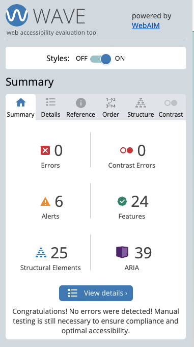

# Tests

## Validation

### HTML Validation

On the HTML validation, there were no errors.

There were warnings, but they were all related to Bootstrap 5 and how they designed their components. In this instance, the validator pointed out elements inside a 'p' or button tag without text.

another warning had to do with the tag that Bootstrap gave me the CDN; some fields seem not to be liked by the validator.

### CSS Validation

No errors were found on the CSS validator.

### JavaScript Linting

No errors were shown in the JS validator. there were a lot of warnings about using the ES6. For example, a warning for me using LET/CONST instead of VAR

### Python Linting

No errors were found on PEP8 on my Flask app.

### Accessibility

I got no error on the grounds of accessibility

### Performance Testing

On all pages, "SEO" and "Best practices" are all in the between 83 and 98.
But the performance and Accessibility are higher in most pages 100.  

## Feature Testing

### Responsiveness/Device Testing

The website was responsive on all devices I used to test. plus, I used hoverify to test their screen sizes

### Browser Compatibility Test

| Browser      | Device  | All Pages Test Status             |
|--------------|---------|----------------------------------|
| Chrome       | Desktop | ✅ Successful (All Pages)         |
| Chrome       | Mobile  | ✅ Successful (All Pages)         |
| Chrome       | Tablet  | ✅ Successful (All Pages)         |
| Firefox      | Desktop | ✅ Successful (All Pages)         |
| Firefox      | Mobile  | ✅ Successful (All Pages)         |
| Firefox      | Tablet  | ✅ Successful (All Pages)         |
| Safari       | Desktop | ✅ Successful (All Pages)         |
| Safari       | Mobile  | ✅ Successful (All Pages)         |
| Safari       | Tablet  | ✅ Successful (All Pages)         |

From registration to canvas art creation, every feature is sparkling on every browser and device.  

### Tools for testing

1. Macbook Pro M1 2021
1. Google Chrome
1. firefox
1. Safari
1. Hoverify (emulates an Extensive Mobile devices list)
1. Google Dev Tools
1. Huawei Mate 20
1. iMac 2019

## User stories testing

We've put our project to the test, darling, and here's how we fared against our user stories:

| User Story ID | Description                               | Test Status                        |
|---------------|-------------------------------------------|------------------------------------|
| US01          | Register a new account                    | ✅ Successful                      |
| US02          | Log in to existing account                | ✅ Successful                      |
| US03          | Subscribe to premium tier                 | ✅ Successful                      |
| US04          | View download limit for free-tier         | ✅ Successful                      |
| US05          | No download limit for premium users       | ✅ Successful                      |
| US06          | Access and use the canvas                 | ✅ Successful                      |
| US07          | Choose preset canvas sizes                | ✅ Successful                      |
| US08          | Download creations in image format        | ✅ Successful                      |
| US09          | Access FAQ section                        | ✅ Successful                      |
| US10          | Read terms and conditions                 | ✅ Successful                      |
| US11          | Read privacy policy                       | ✅ Successful                      |
| US12          | Delete the account                      | ✅ Successful                      |
| US13          | change details and password                   | ✅ Successful                      |

All tests were conducted rigorously to ensure that each feature works as intended, providing a seamless experience for all users. 🌟

## Bugs

* Once the user registers, sometimes they get redirected to the dashboard already logged in, and sometimes they get not logged in and have to log in again. I couldn't find out what makes this unpredictable behaviour.

* Colour picker works differently in Firefox, so it only updates the canvas once you click off the picker. It doesn't produce any errors, just a less smooth user experience. 

* Fonts don't seem to load well on Safari; I have seen this issue online but couldn't find a way to make it work for my project.

| [Deployment <---- Before](dep.md)  | [NEXT ---> Credits](credits.md) |
|:----------|:----------|