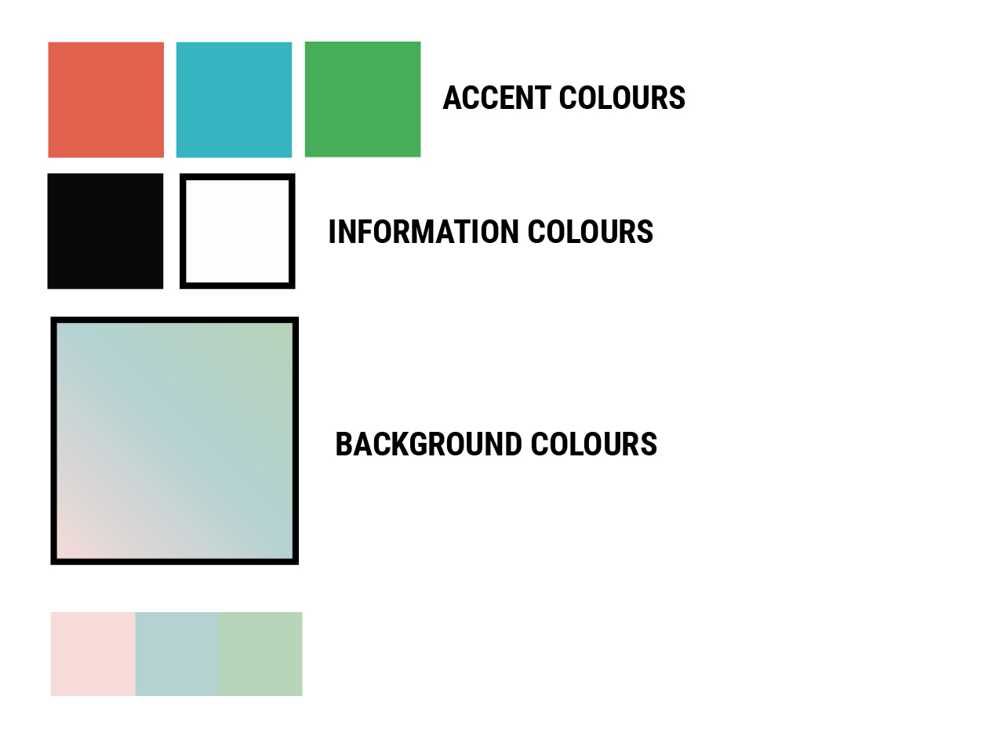
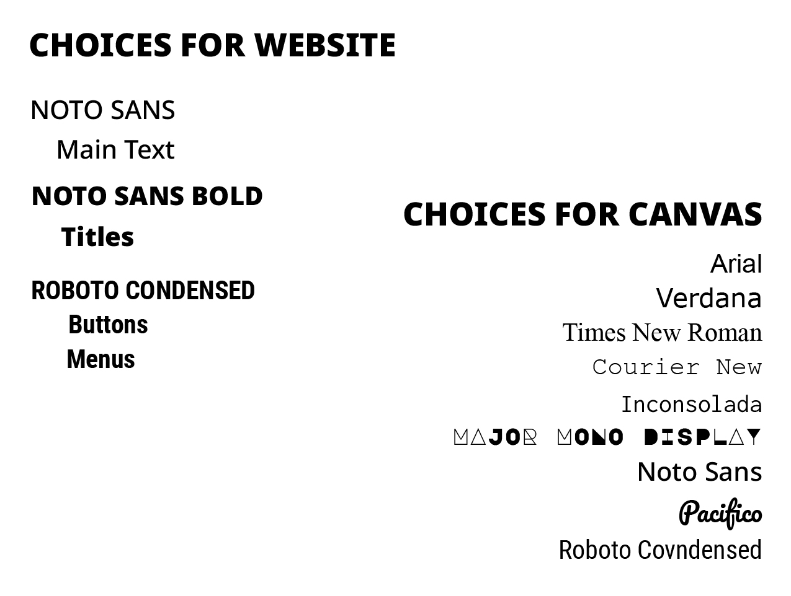
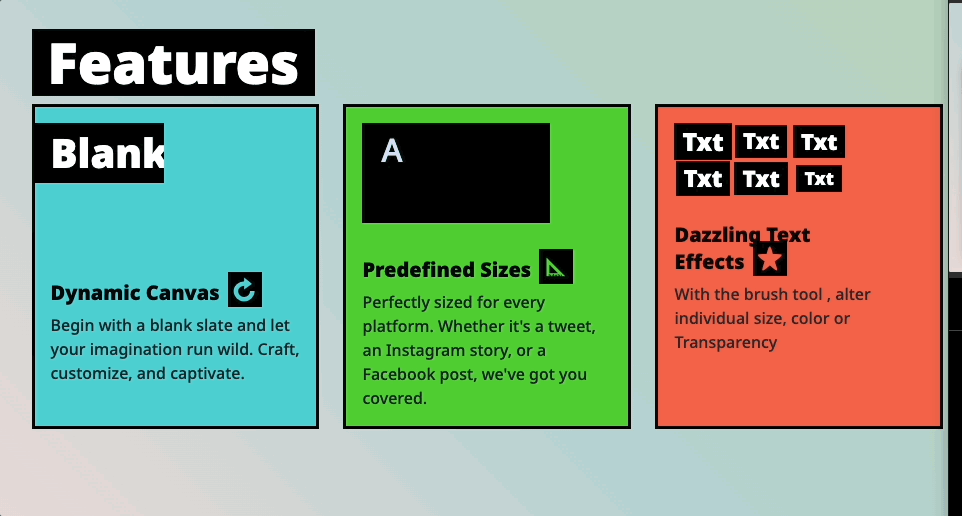
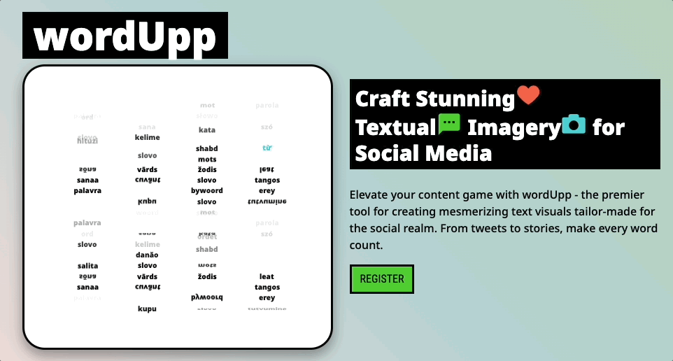

# User Experience

User Experience (UX) within wordUpp refers to users' overall journey and feelings when crafting text-based images. It's about ensuring that users find the application intuitive, satisfying, and enjoyable, leading to stunning textual imagery creations with ease.

---

## Strategy Plane

At the strategy level, wordUpp aims to make a small mark on text-based visual content creation for social media. The primary goal is to empower users to create captivating word art effortlessly, ensuring their content stands out and resonates with their audience.

### Target Audience

- mainly the Social media users that post.
- Any other case in which a user might need word art with this style

### Market Research

- Noticing that there is a type of post on social media that is just text; it comes in the format of an image because of attention.
- I didn't find any app with the possibility of grid and repetition. I, of course, took Photoshop out of the equation and thought that a simple tool for a specific style would have its place.

### User Goals

- User will achieve a specific type of content. base on word, or word + image, or word + image + effects.
- the user can compose and download their creations after registration 
	- free (0.00, limit 10 per month)
	- premium (0.99 Unlimited)
- users get to combine their style with grid-based word art.
- Users that want word art without thinking of the ugly word art from the 90s.

### Bussiness Goals

- The main goal is to carve a specific new style in the global social media zeitgeist.
- That comes with a premium price for maintenance and little profit. 

---

## Scope Plane

In terms of scope, wordUpp offers a range of features tailored to textual design. The application encompasses all the essential tools to craft unique and visually appealing text visuals, from dynamic canvas rendering and novel text effects to predefined social media sizes.

### Core Features 

#### Canvas feature

| Feature | what does it do  | Essential (0 to 5) |
|:----------|:----------|:----------|
| User Text  | Dynamic user text input on change updates the canvas   | 5  |
|Reset Btn| Resets the canvas to its original state | 1  |
|Dynamic Canvas| changes according to user input | 5 |

##### on canvas size

| Features  | what does it do  | Essential (0 to 5) |
|:----------|:----------|:----------|
|canvas width | changes width of canvas | 5 |
|canvas height | changes height of canvas | 5 |
|canvas size presets | a series of presets with the main social media sizes | 2 |

##### on text controls

| Features | what does it do  | Essential (0 to 5) |
|:----------|:----------|:----------|
|Fonts | changes the font | 5 |
|Font colour | color picker for overall text color | 5 |
|font Size | updates the size of overall text | 5 |
|Random order tick | turn on or off the random order of user text | 4 |

##### on background (BG)

| Features | what does it do  | Essential (0 to 5) |
|:----------|:----------|:----------|
|BG colour | colour picker for BG colour | 5 |
|BG Image | BG image from user filles | 5 |
|Remove BG button  | removes BG button | 5 |
|BG size | zooms the BG image in or out based on percentage | 5 |
|BG POS x| offsets left or right| 5|
|BG POS y| offsets top or bottom| 5|
|primary colours| colours for the background presets| 3|
|BG  Presets| collection of BG presets| 3|

##### on  Line Control

| Features | what does it do  | Essential (0 to 5) |
|:----------|:----------|:----------|
|Vertical Lines | controls number of lines vertically | 5 |
|Horizontal Lines |controls number of lines horizontally| 5 |
|Vertical Spacing | spacing between lines | 5 |
|Horizontal Spacing  | spacing between words | 5 |
 

##### on Brush tools

| Features | what does it do  | Essential (0 to 5) |
|:----------|:----------|:----------|
|DELETE| Turn opacity off of certain words| 3|
|COLOUR | changes colour of individual words| 3|
|CHANGE SIZE| updates the size of individual words, bigger or smaller| 3|
|Randomise Size| RANDOMISE of individual words, between a max and min value | 3|

#### Dashboard

##### on user detail
| Features | what does it do  | Essential (0 to 5) |
|:----------|:----------|:----------|
|present user name| - | 1|
|change details  | user can change their details| 5 |
|change password | user can change their password| 5 |
|delete account | user deletes account and their detail | 5|

##### on subscription
| Features | what does it do  | Essential (0 to 5) |
|:----------|:----------|:----------|
|shows current subscription| - | 5 |
|shows download limit if free | - | 5|
|show upgrade button if free | - | 5|
|show download so far if premium | - | 5|
|show manage subscription if premium| you can manage your stripe subscription with stripe portal | 5|

 
### User Stories 

The following table outlines the user stories for the Word Up app.

| User Story ID | As a...            | I want to...                            | So that I can...                                      |
|---------------|--------------------|-----------------------------------------|--------------------------------------------------------|
| US01          | New Visitor        | register                                | create an account and start making word art            |
| US02          | Registered User    | log in                                  | access my canvas and saved projects                    |
| US03          | Registered User    | subscribe to the premium tier           | unlock unlimited downloads for $0.99 a month           |
| US04          | Free-tier User     | see my download limit                   | know how many downloads I have left for the month      |
| US05          | Premium User       | not worry about a download limit        | freely download as many creations as I want            |
| US06          | User               | have a canvas                           | create my social media word art                        |
| US07          | User               | choose preset canvas sizes              | easily create art for different social media platforms |
| US08          | User               | download my creation (image format)     | share it on social media or keep it                    |
| US09          | User               | access a FAQ section in the footer      | get quick answers to common questions                  |
| US10 		     | User 			  | read term and condition | be aware of how the information works|
| US11			 | User 			  | read privacy            | know about user data|

---

## Structure Plane

wordUpp's structure is designed to provide a logical and seamless user flow. This includes intuitive navigation, categorisation of design tools, and a coherent pathway that guides users from selecting canvas size and choosing text effects to finalising their design masterpieces.

### User Flow

Here's a step-by-step walkthrough of a typical user session on Word Up:

1. **Landing Page**: 
    - The user lands on the homepage and is greeted with an engaging hero section and a quick overview of what Word Up offers.

2. **Registration/Login**: 
    - New users can register by clicking on the "Register" button.
    - Returning users can click the "Log In" button on the top menu to access their account.

3. **Dashboard**: 
    - Users arrive at the dashboard where they can see their current subscription tier and the download limits, if any.
    - A prompt for free-tier users to upgrade to the premium tier may appear.

4. **Canvas Selection**: 
    - Users can go to the canvas page to start a project.

5. **Art Creation**: 
    - They can select the canvas size based on popular social media dimensions.
	- they are given multiple menus and the option to manipulate the words and the backgrounds.

6. **Save/Download**: 
    - Once satisfied with their creation, users can click the download button and get their creation.
    - Free-tier users see a download counter, while premium users have unlimited downloads.

7. **Log Out/Exit**: 
    - Users can log out from the dashboard or close the application.

8. **Footer**: 
    - Throughout the session, users have the option to access general user information

### Information Architecture

#### Main Top Menu

* available to all the websites (dynamic according to logged or not)

#### Footer 
- **Privacy Policy & Terms of Service**: Legal links are at the bottom of every page.
- © 2023 WORDUPP. ALL RIGHTS RESERVED.

#### Dashboard

- **Subscription Tier**: Displays the current subscription level of the user.
- **Upgrade Prompt**: A call-to-action for free-tier users to upgrade to the premium tier.

#### Canvas

- there are several menus for tools that you can use, organised in groups.
- you can click and drag horizontally to see all the tools from a category (works on mobile)
- all changes are immediately reflected on the canvas
- you have a download button 
- you have a limit of downloads in the case of the free tier; when you reach a limit, you get a message that the download button has become disabled. 

### Error Handling:

- All forms have error handling. They will specify which field the error is coming from.
- User-related error messages from the server are shown in the front end in a user-friendly manner.

 

---

## Skeleton Plane

The skeleton of wordUpp is its foundational design blueprint. Through wireframes and basic layouts, wordUpp ensures a balanced placement of design tools, clear pathways for user tasks, and an organised interface that prioritises the user's design process, making it efficient and enjoyable.

### UI Components:

#### Buttons

- **Sign Up / Log In Buttons**: Placed prominently on the landing page to guide users to create an account or log in.
- **Download Buttons**: These are on the canvas workspace, enabling users to save their progress or download their creations.
- **change details**
- **change password**
- **delete account**
- **upgrade button**

#### Text Boxes

- **Username / Password Fields**: These are essential for the login and registration process, ensuring secure access.
- **Text Input on Canvas**: Users can enter the text they wish to turn into word art.
- **Email** input field for register
- **Change details fields** for dashboard user options
- **Change password fields** for dashboard user options

#### Color Pickers

- **for text colour**
- **for background colour**
- ** or the background presets**

#### Sliders

- **for horizontal lines**
- **for vertical lines**
- **for horizontal spacing**
- **for vertical spacing**
- **for background image zoom**
- **for background image offset x**
- **for background image offset y**

#### Selects

- **Fonts**
- **Social media presets**
- **background presets**
- **brush tools**

#### Number Input

- **width**
- **height**
- **word size**
- **random size max and min**

#### Modals

- **terms**
- **privacy**
- **change pass**
- **change details**
- **delete account**

### Navigation

- top menu, leading way to navigate between pages, always present
- buttons that take you to specific pages or open modals with relevant information

### Responsiveness 

WordUpp's responsive design ensures a fabulous and consistent user experience across various devices. Built on Bootstrap 5.2, the app gracefully adapts to different screen sizes and orientations. Here are some highlights:

#### Mobile Devices

- **Collapsible Menu**: The main menu turns into a hamburger menu to save space.
- **Touch-Friendly menu drag**: The canvas is optimised for touch interactions, making creating art on the go easy.

#### Tablets

- **Adaptive Layout**: The UI components adjust to best use the available screen real estate.
- **Portrait and Landscape Modes**: The app adjusts seamlessly when the orientation changes.

#### Desktops

- **Expansive Canvas**: Takes advantage of larger screen sizes to offer an expansive canvas for intricate designs.
- **Accessible Toolbars**: All editing tools are easily accessible without overwhelming the interface.

#### General Features

- **Fluid Grids**: Thanks to Bootstrap's grid system, all elements scale proportionally, maintaining their relational layout.
- **Breakpoints**: Customized breakpoints are employed to fine-tune the design at various screen widths.

### Wireframes
 

HOMEPAGE laptop

HOMEPAGE mobile

LOGIN laptop

LOGIN mobile

 
 

REGISTER laptop

REGISTER mobile

 

DASHBOARD laptop

DASHBOARD mobile

 

 

CANVAS laptop

CANVAS mobile

---

## Surface Plane

On the surface, wordUpp showcases a modern and sleek design. With a harmonious blend of colours, typography, and visual elements, the application ensures that every interaction is functional and aesthetically pleasing, echoing the essence of creating stunning textual imagery.

### Color Scheme

The design tries to assert itself as a strong-edge electric bubble gum, a massive contrast with solid colours, with three different accent colours that complement it. 
The background is soft to complement the black-and-white solid contrast of the text. 

### Typography

Two fonts, One strong with a lot of weight and the other with a condensed width for buttons and other UI controls.

I chose a good range of fonts from Google font for the canvas. Enough to give various choices and moods to achieve any look and feel.

### Imagery and Icons

For the youthful look, I populated the website with chunky icons all over, when possible, with accent and black colours contrasting with an accent colour. 

### Micro-interactions 

I made a few animations to raise interest, especially on the homepage. 

* features sections:

* hero section:

