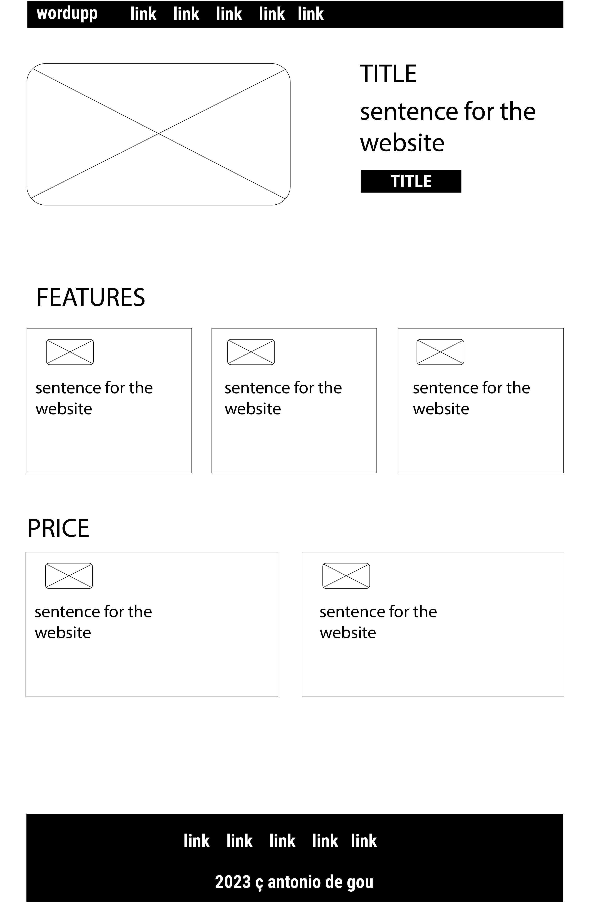
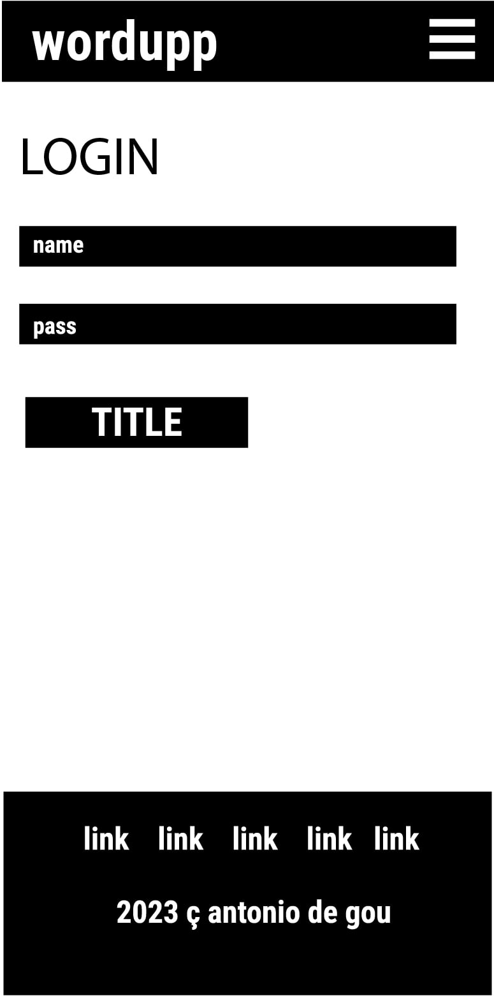
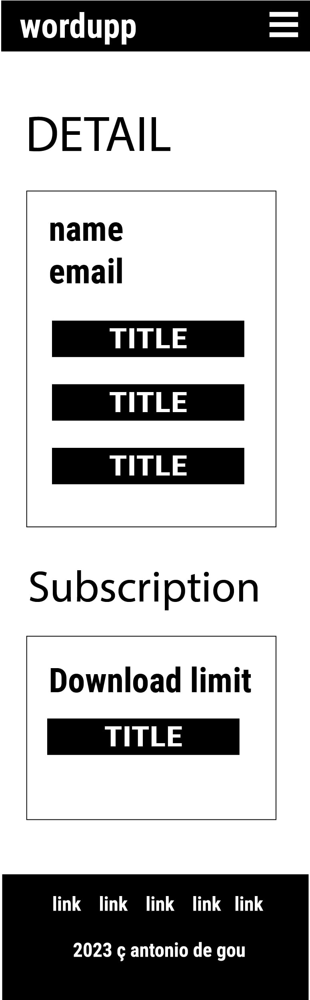

# Skeleton Plane

The skeleton of wordUpp is its foundational design blueprint. Through wireframes and basic layouts, wordUpp ensures a balanced placement of design tools, clear pathways for user tasks, and an organised interface that prioritises the user's design process, making it efficient and enjoyable.

## UI Components:

### Buttons

- **Sign Up / Log In Buttons**: Placed prominently on the landing page to guide users to create an account or log in.
- **Download Buttons**: These are on the canvas workspace, enabling users to save their progress or download their creations.
- **change details**
- **change password**
- **delete account**
- **upgrade button**

### Text Boxes

- **Username / Password Fields**: These are essential for the login and registration process, ensuring secure access.
- **Text Input on Canvas**: Users can enter the text they wish to turn into word art.
- **Email** input field for register
- **Change details fields** for dashboard user options
- **Change password fields** for dashboard user options

### Color Pickers

- **for text colour**
- **for background colour**
- ** or the background presets**

### Sliders

- **for horizontal lines**
- **for vertical lines**
- **for horizontal spacing**
- **for vertical spacing**
- **for background image zoom**
- **for background image offset x**
- **for background image offset y**

### Selects

- **Fonts**
- **Social media presets**
- **background presets**
- **brush tools**

### Number Input

- **width**
- **height**
- **word size**
- **random size max and min**

### Modals

- **terms**
- **privacy**
- **change pass**
- **change details**
- **delete account**

## Navigation

- top menu, leading way to navigate between pages, always present
- buttons that take you to specific pages or open modals with relevant information

## Responsiveness 

WordUpp's responsive design ensures a fabulous and consistent user experience across various devices. Built on Bootstrap 5.2, the app gracefully adapts to different screen sizes and orientations. Here are some highlights:

### Mobile Devices

- **Collapsible Menu**: The main menu turns into a hamburger menu to save space.
- **Touch-Friendly menu drag**: The canvas is optimised for touch interactions, making creating art on the go easy.

### Tablets

- **Adaptive Layout**: The UI components adjust to best use the available screen real estate.
- **Portrait and Landscape Modes**: The app adjusts seamlessly when the orientation changes.

### Desktops

- **Expansive Canvas**: Takes advantage of larger screen sizes to offer an expansive canvas for intricate designs.
- **Accessible Toolbars**: All editing tools are easily accessible without overwhelming the interface.

### General Features

- **Fluid Grids**: Thanks to Bootstrap's grid system, all elements scale proportionally, maintaining their relational layout.
- **Breakpoints**: Customized breakpoints are employed to fine-tune the design at various screen widths.

## Wireframes
 

HOMEPAGE laptop

HOMEPAGE mobile

LOGIN laptop

LOGIN mobile

 
 

REGISTER laptop

REGISTER mobile

 

DASHBOARD laptop

DASHBOARD mobile

 

 

CANVAS laptop

CANVAS mobile

[NEXT ---> Surface Plane](ux_surface.md)