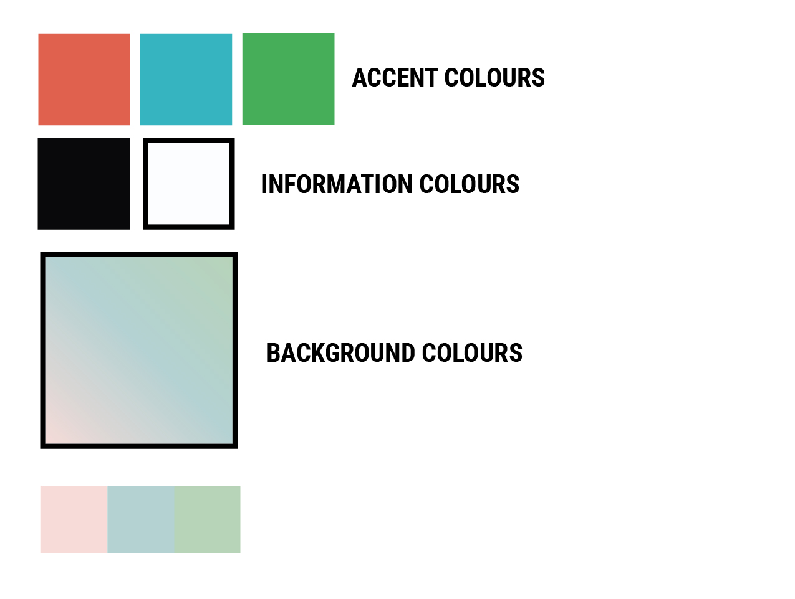
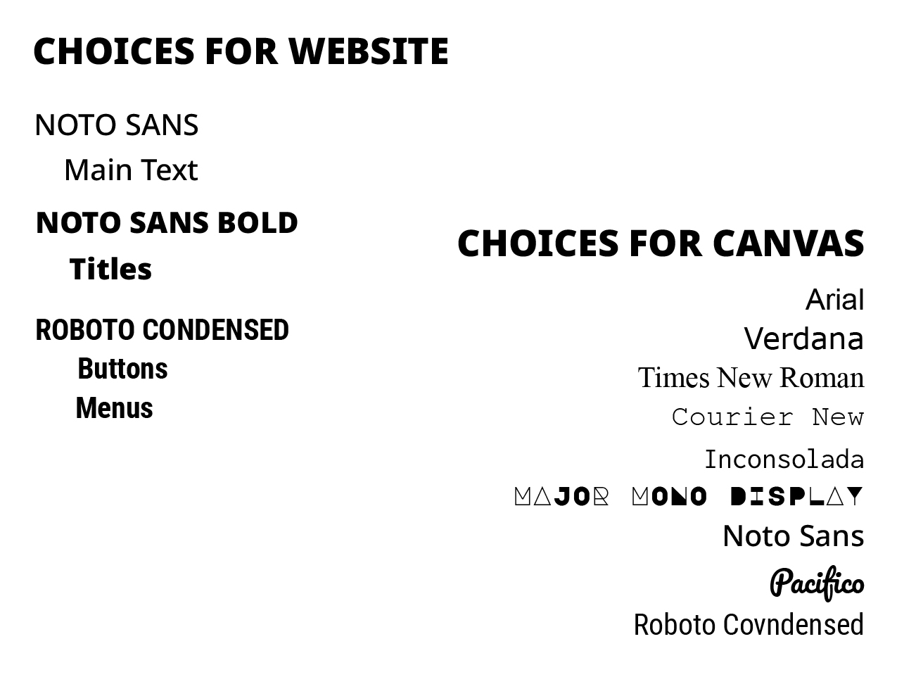
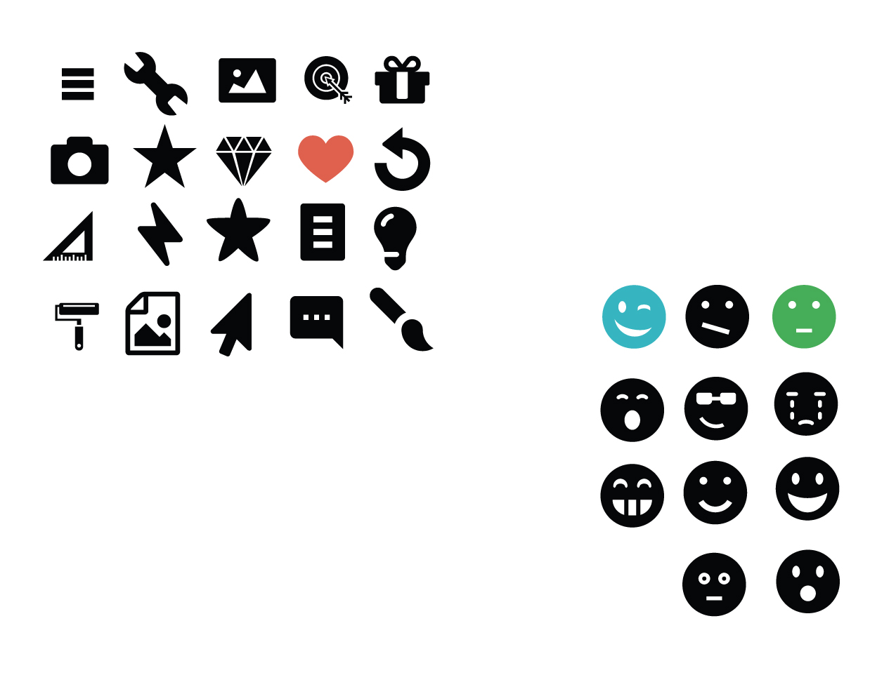
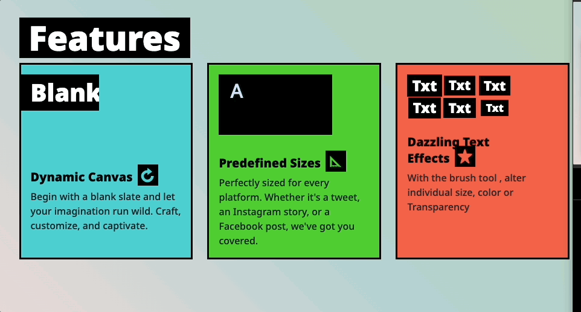

# Surface Plane

## Color Scheme

The design tries to assert itself as a strong-edge electric bubble gum, a massive contrast with solid colours, with three different accent colours that complement it. 
The background is soft to complement the black-and-white solid contrast of the text. 

## Typography

Two fonts, One strong with a lot of weight and the other with a condensed width for buttons and other UI controls.

I chose a good range of fonts from Google font for the canvas. Enough to give various choices and moods to achieve any look and feel.

## Imagery and Icons

For the youthful look, I populated the website with chunky icons all over, when possible, with accent and black colours contrasting with an accent colour. 

## Micro-interactions 

I made a few animations to raise interest, especially on the homepage. 

* features sections:

* hero section:

 

| [Skeleton Plane <---- Before](ux_skeleton.md)  | [NEXT ---> Techonologies](tech.md)  |
|:----------|:----------|